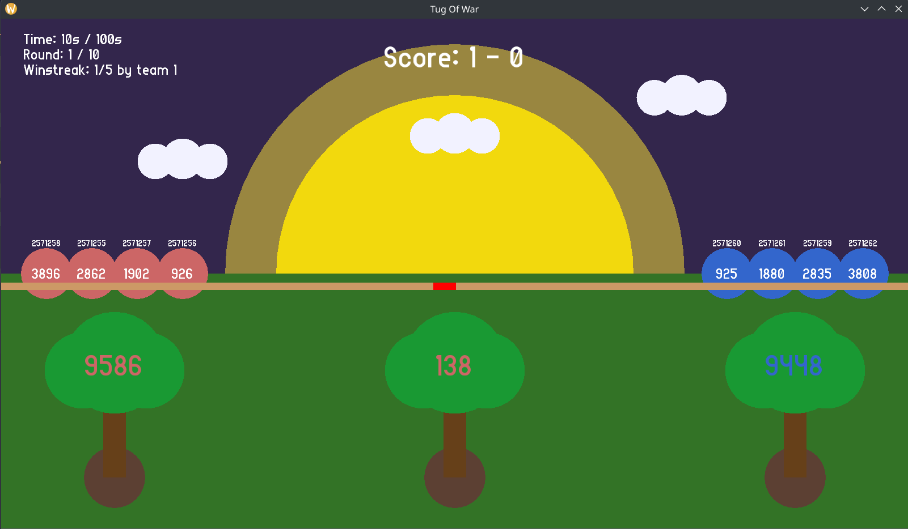

# 🧠 Tug of War Simulation (Multiprocessing + OpenGL)

This project is a Linux-based simulation of a **Tug of War** game using **multiprocessing** and **OpenGL** for visualization. The simulation consists of three processes:

- `referee`: Manages the game rules, logic, and communication.
- `player`: Represents a team player that responds to referee signals.
- `graphics`: Handles graphical representation using OpenGL.

Each team consists of 4 players (customizable), and the game progresses over multiple rounds based on player energy, strategy, and random events like falling.

---

## 📦 Features

- Multi-process communication using **signals**, **pipes**, and **fifos**.
- Dynamic configuration from text files (or use defaults).
- Real-time visualization with **OpenGL + GLFW + **GLAD** + FreeType**.
- Energy-based game mechanics, randomized behaviors, and fall recovery.
- Customizable in game font (replace **fonts/arial.ttf**).

---

## ⚙️ Configuration Files

Three configuration files control the simulation. If not provided, default ones will be generated.

### `game_config.txt`

```
max_simulation_time = 100
max_number_of_rounds = 10
score_gap_to_win = 6000
max_consecutive_wins = 5
```

### `team1_config.txt` and `team2_config.txt`

```
num_players = 4
initial_energy_range = 950 1000
energy_decay_range = 1 5
fall_probability = 0.010000
fall_time_range = 10 20
```

---

## 🛠️ Build Instructions (Linux)

Make sure you have the required libraries installed:

### ✅ Dependencies

```bash
sudo apt update
sudo apt install build-essential libglfw3-dev libgl1-mesa-dev libfreetype6-dev
```

## 🔨 Build the Programs

### To compile all components in debug mode

```bash
make
```

### To compile all the components in release mode

```

make BUILD=release
```

```

```

and then to run:

```bash
./bin/referee
```

Compiled binaries will be placed in the `bin/` directory.

---

## Game Screen



- The number in the tree on the left (right) represents the cumulative total of the team on the left (right).
- The number in the center tree represents the difference in total energy between the two teams. Its color reflects the leading team's color.
- The red mark on the rope is a visual indicator of which team is closer to winning. It corresponds to the value shown in the center tree.
- Players are represented by circles. The number inside the circle shows the current energy. The number above it is the player's process ID (PID), useful for tracking.
- The panel on the left and the score at the center indicate the current game state.
- If a player falls, their circle turns yellow and a timer appears below, showing how long until they recover.
